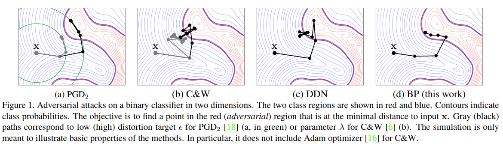

## BP attack 



This code is for the paper [Walking on the Edge: Fast, Low-Distortion Adversarial Examples](https://arxiv.org/abs/1912.02153). This paper is published on Transactions on Information Forensics and Security.

## Latest Updates

The original code is built based on the TensorFlow. The TensorFlow version is usable. 

We are have some issues on the Pytorch version. Currently, the Pytorch version does not perform the similar way as TensorFlow verison. We have memory issue and the distorsion is much higher than the TensorFlow version. 

Please check the link below for the Pytorch version.
https://gitlab.inria.fr/bbonnet/adversarial-quantization/-/blob/master/attacks/bp_attack.py

## Run the code
1. Install dependencies.

[CleverHans](https://github.com/tensorflow/cleverhans)

2. Run the experiments on MNIST.

```bash
cd tensorflow
python mnist_our.py
```

3. Run the experiments on ImageNet.

```bash
cd tensorflow
python func5.py
```

-----------------------------------
    BP attack
    Copyright (C) 2020 Hanwei Zhang -  Inria Rennes Bretagne Atlantique

    BP attack is free software; you can redistribute it and/or modify
    it under the terms of the GNU General Public License as published by
    the Free Software Foundation; either version 2 of the License, or
    (at your option) any later version.

    BP attack is distributed in the hope that it will be useful,
    but WITHOUT ANY WARRANTY; without even the implied warranty of
    MERCHANTABILITY or FITNESS FOR A PARTICULAR PURPOSE.  See the
    GNU General Public License for more details.

    To receive a copy of the GNU General Public License, see <http://www.gnu.org/licenses/>.
-------------------------------------
